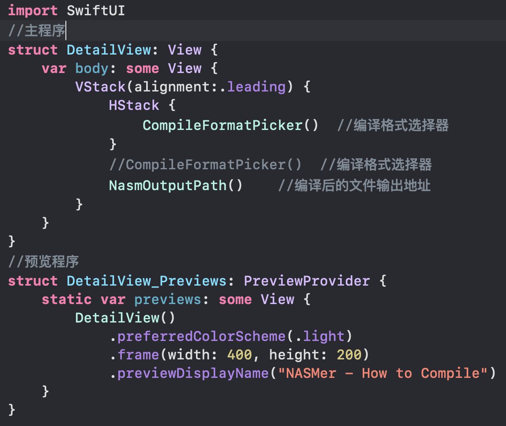
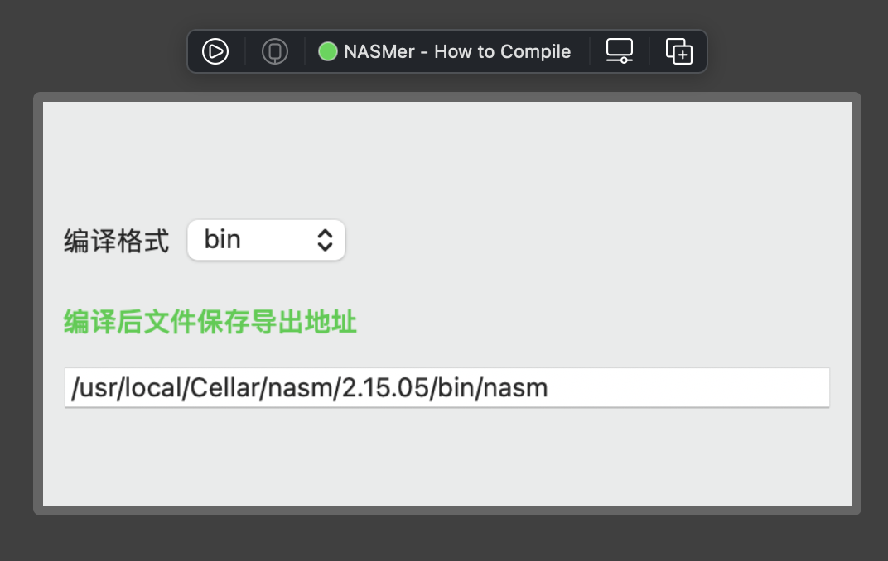

[TOC]

这个文档将讲述工程文件中各个组件的作用以及使用方法

# NASMerApp.swift文件

这个文件内的程序控制着整个应用程序的窗口大小

通过

```swiftUI
WindowGroup{
            DetailView()
                .frame(width: 400, height: 200)
                .preferredColorScheme(.light)
        }
```

这个组件进行控制

其中的 ***DetailView*** 这个名字对应着窗口的控制件的名字





就是对应的这个窗口

# ContentView.swift文件

## 如何创建一个新的窗口

先给出示例代码

```swift
//Swift5 macOS Big Sur下可以使用
import SwiftUI
import Cocoa

struct ContentView: View {
    var body: some View {
        VStack{
            Spacer()
            Button("打开新窗口"){
                let detailView = DetailView()
                let controller = DetailWC(rootView: detailView)
                controller.window?.title = "新窗口"
                controller.showWindow(nil)
            }
            Spacer()
            Divider()
        }
        .frame(width: 600, height: 500)
    }
}

struct ContentView_Previews: PreviewProvider {
    static var previews: some View {
        ContentView()
    }
}


class DetailWC<RootView : View>: NSWindowController {
    convenience init(rootView: RootView) {
        let hostingController = NSHostingController(rootView: rootView.frame(width: 400, height: 500))
        let window = NSWindow(contentViewController: hostingController)
        window.setContentSize(NSSize(width: 400, height: 500))
        self.init(window: window)
    }
}

struct DetailView: View {
    var body: some View {
        VStack{
            Spacer()
           Text("我是新窗口")
            Spacer()
        }
    }
}
```

这里需要先讲解一下一些基础知识

NSHostingController:托管SwiftUI视图层次结构的AppKit视图控制器

```swift
class NSHostingController<Content> where Content : View
```

当要将SwiftUI视图集成到AppKit视图层次结构中时，创建一个对象，在创建时，指定要用作此视图控制器的根视图的SwiftUI视图。

这里我把

```swift
struct DetailView: View {
    var body: some View {
        VStack{
            Spacer()
           Text("我是新窗口")
            Spacer()
        }
    }
}

class DetailWC<RootView : View>: NSWindowController {
    convenience init(rootView: RootView) {
        let hostingController = NSHostingController(rootView: rootView.frame(width: 400, height: 200))
        let window = NSWindow(contentViewController: hostingController)
        window.setContentSize(NSSize(width: 400, height: 200))
        self.init(window: window)
    }
}
```

这两个部分程序分别分离到单独的文件当中

## 显示编译设定窗口

在ContentView.swift文件中，代码为

```swift 
Button("编译前的设定"){
                    let detailView = DetailView()
                    let controller = DetailWC(rootView: detailView)
                    controller.window?.title = "NASMer - How to Compile"
                    controller.showWindow(nil)
                }
```

这个是一个按键的代码段，其控制程序在CompileSettingWindowConfig.swift这个文件中，文件中的代码如下

```swift
//
//  CompileSettingWindowConfig.swift
//  NASMer
//
//  Created by Willian_Kuang on 2021/2/10.
//
import Foundation
import SwiftUI
import Cocoa
//import SavannaKit
//import SourceEditor
//import UIKit

//显示编译设定窗口
class DetailWC<RootView : View>: NSWindowController {
    convenience init(rootView: RootView) {
        let hostingController = NSHostingController(rootView: rootView.frame(width: 400, height: 200))
        let window = NSWindow(contentViewController: hostingController)
        window.setContentSize(NSSize(width: 400, height: 200))
        self.init(window: window)
    }
}
```

注意这里得要导入三个库，不然程序里面会报错的。

